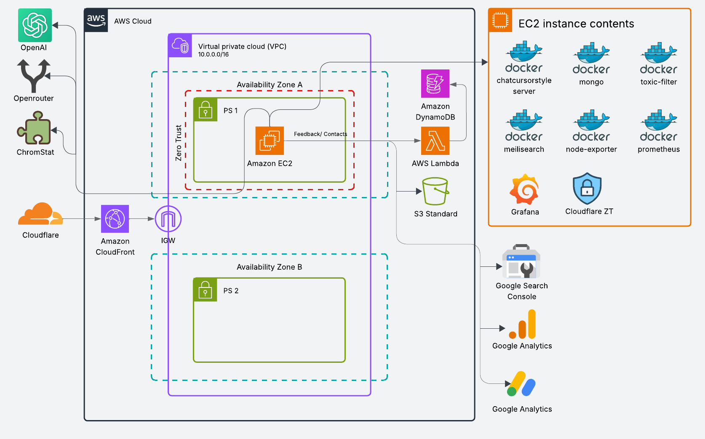
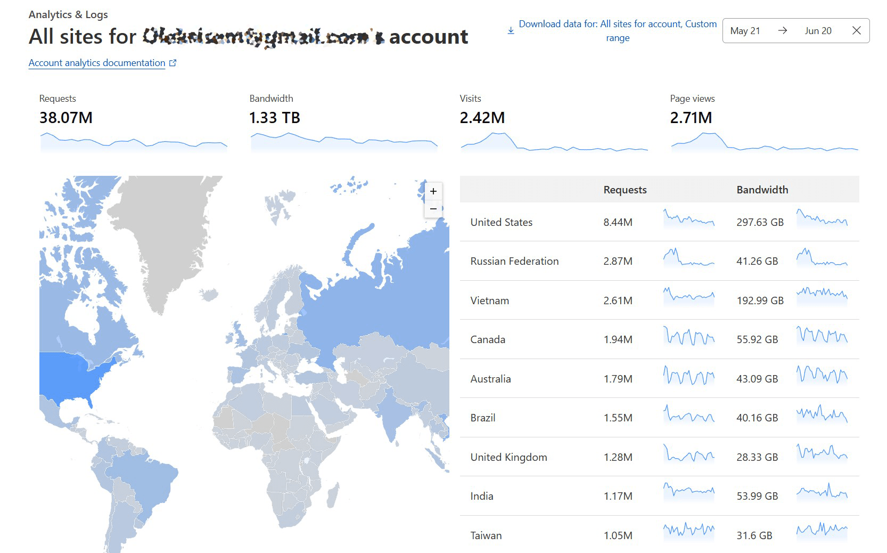
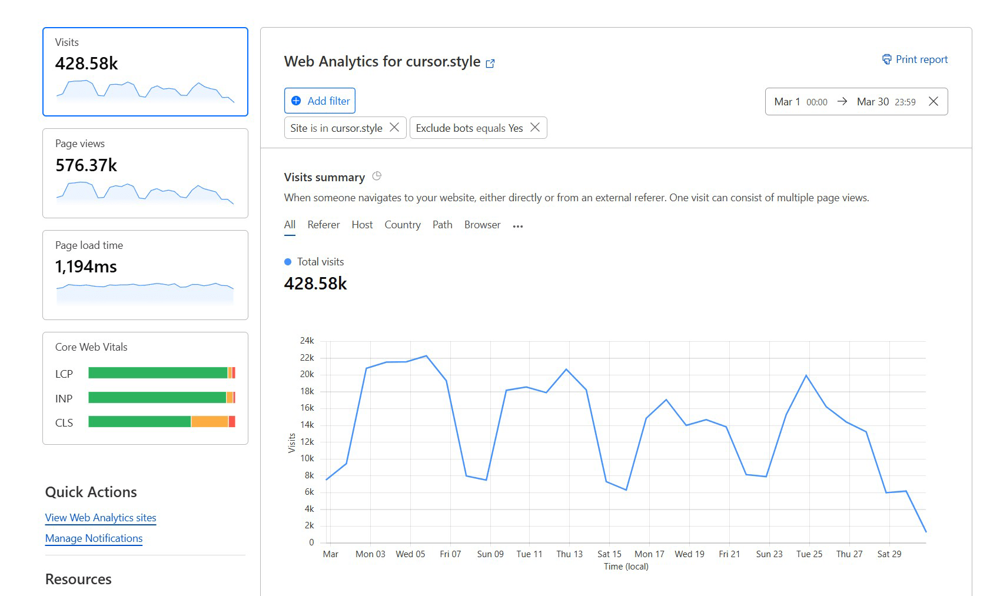
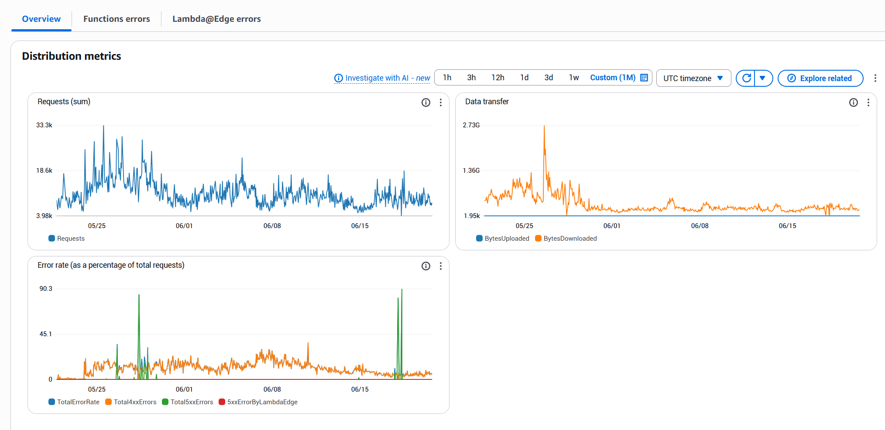
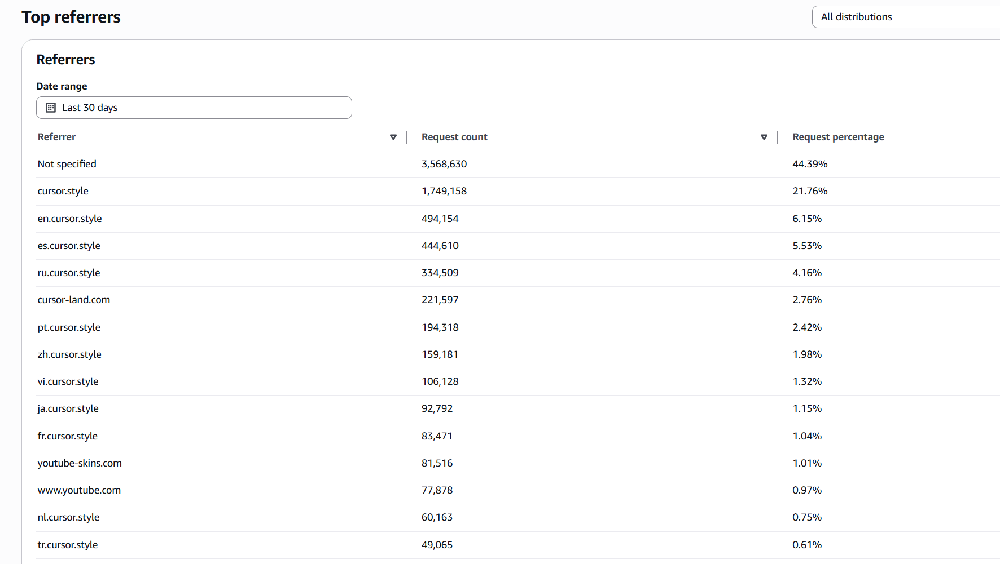

# Cursor.style - Infrastructure Overview & Architecture

A simple project with maximum optimization and cost-efficiency, built using available tools and free-tier services wherever possible.

---

## ☁️ Hosting & Server
- EC2 `t3a.small`, Reserved Instance for 3 years — $93 total (≈$2.58/month)
- Additional: public IP ($3), EBS 25GB gp3 ($1.5), AWS Backup ($2)
- Total monthly cost — ~$6.5 (IP: $3, EBS: $1.5, Backup: $2)
- Can be made even cheaper:
  - Remove AWS Backup
  - Package everything in a Docker container or CloudFormation template for quick re-deployment

---

## 🛠️ Backend
- Laravel 12
- Database: MySQL installed directly on the EC2 instance
- Backups:
  - Daily dump using `mysqldump`, gzipped to ~22MB, uploaded to S3 with 14-day lifecycle
  - Full AMI backups via AWS Backup
  - S3 for backups (because why not — almost free)
- All static assets are stored within the Laravel project, with a backup on GitHub and locally. While best practice suggests storing assets in S3, it was decided to keep them local for simplicity.

---

## 📈 Traffic & Optimization

- The entire site is cached
- Dynamic pages: cache expires every 2 hours
- Static content: longer expiration
- All optimized to reduce EC2 load

### 🔁 Event Tracking
- Cursor download clicks are sent to Google Analytics as custom events via gTag
- Every 5 minutes, an API request pulls event stats
- Stats are updated in the database per cursor, adding to the previous count
- Installs/uninstalls are also tracked

---

## 🌐 SEO & Translations
- Upon uploading a cursor, several tasks run:
  - Tag generation based on cursor and collection name
  - Cursor and collection descriptions are generated
  - Translated into 50+ languages via OpenRouter (Google models)
- A multilingual sitemap is regenerated monthly and submitted to Search Console

---

## 💬 Feedback & Contact
- Built using AWS Lambda + DynamoDB (fully within the Free Tier)
- Offloads even more traffic from the main server

---

## 🌐 CDN Strategy: Cloudflare + CloudFront

- Initially used only CloudFront, but request limits led to added cost
- Final setup: Cloudflare in front of CloudFront
- Benefits: Caching, WAF, analytics, and request offloading
- Cloudflare handles both edge traffic and static content, with CloudFront acting as an additional layer

---

## 🚀 Deployment Pipeline
- The pipeline is intentionally simple and efficient.
- It triggers an AWS Lambda function, which then uses **SSM Run Command** to pull the latest changes directly on the production EC2 instance.
- Deployment happens almost instantly.
- For this project, it’s the most straightforward and effective pipeline possible — minimal overhead, near-instant execution, and fully server-driven.

---

## 🔍 Search
- Meilisearch is containerized and separated from the main app
- One index per language
- Cursors are added to Meilisearch shortly after upload, as part of the update flow

---

## 📊 Monitoring
- Metrics collected via Prometheus
- Displayed in Grafana
- Plan to eventually render all metrics directly in the Laravel admin panel (which already includes a lot of analytics)

---

## 💬 Chat
- 3 containers: chat server, MongoDB, and toxicity filter
- Toxicity detection:
  - Custom ML model trained on 8M comments (very fast)
  - If passed, then checked again via OpenRouter (Haidy AI)
  - Efficient across multiple languages

---

## 🔐 Zero Trust via Cloudflare
- Port 22 on EC2 is closed
- SSH access via WARP tunnel (Cloudflare Zero Trust)
- Acts like a VPN, but more secure and modern

---

## ⚠️ Disclaimer
> This project is for educational purposes only. 
> Do not use any resources or code without explicit permission.
